```{=html}
<div class="portfolio-header">
  <div class="portfolio-header-top">
    <div class="portfolio-title">Portfolio</div>
    <div class="portfolio-links">
      <a href="https://www.datacamp.com/portfolio/edwardarchaeology">Datacamp certifications/projects</a>
      <a href="project_writeups/presentations.qmd">Selected presentations</a>
    </div>
  </div>
  <p class="portfolio-intro">
    I build practical, end-to-end data and geospatial solutions – from scrapers and ETL pipelines, to interactive apps, dashboards, and research workflows. Below is a selection of projects, organized into two groups: <strong>Interactive apps &amp; tools</strong> and <strong>Research &amp; methods</strong>.
  </p>
</div>
```

<h2>Interactive apps &amp; tools</h2>

<div class="portfolio-grid"
     style="display:grid;grid-template-columns:repeat(auto-fit,minmax(340px,1fr));gap:2rem;margin-top:2rem;">

<div class="project-card">

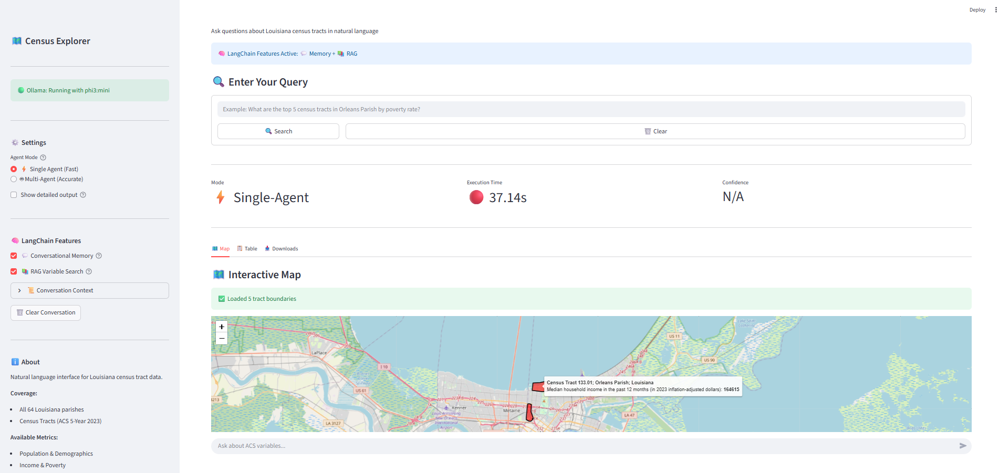{.project-thumb}

### Census LLM Agent (Analysts & Planners)

**Impact:** Enabled non-technical users to explore and extract insights from U.S. Census data using natural language requests, reducing the effort of crafting API queries and manual data pulls.

**What it does:** Interactive Census query agent that translates natural language into structured API calls.

**Tech:** Python · LLM agents · Docker

[View code](https://github.com/edwardarchaeology/census-llm-agent){.btn .btn-primary .btn-sm}

[LLM]{.badge} [Agents]{.badge} [Docker]{.badge} [Census]{.badge}

</div>


<div class="project-card">

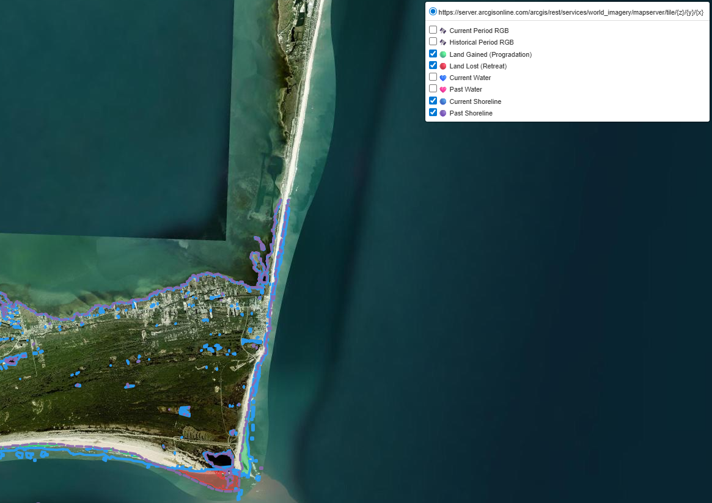{.project-thumb}

### Coastal Change Detection App (Environmental Researchers & Planners)

**Impact:** Accelerated detection of shoreline change trends by providing an interactive platform for visual comparison of satellite imagery, cutting analysis time from hours to minutes.

**What it does:** Coastal change explorer for interactive shoreline analysis.

**Tech:** Python · Shiny · Remote sensing

[View app](https://ecleland-coastal-change-detection-app.share.connect.posit.cloud){.btn .btn-primary .btn-sm}

[Python]{.badge} [Shiny]{.badge} [Environmental]{.badge} [Remote sensing]{.badge}

</div>

<div class="project-card">

<video class="project-thumb" autoplay muted loop playsinline>
  <source src="assets/project_videos/whi_app.mp4" type="video/mp4">
</video>

### Waffle House Index Geospatial App (Emergency Planners)

**Impact:** Helped planners quickly identify areas with potential storm impact by enabling fast filtering and export of geospatial data, supporting more informed resource allocation decisions.

**What it does:** Storm impact & resilience tool for emergency planning.

**Tech:** R · Shiny · Geospatial

[View app](https://ecleland-waffle-house-index.share.connect.posit.cloud){.btn .btn-primary .btn-sm}

[Shiny]{.badge} [Mapping]{.badge} [Public safety]{.badge}

</div>

<div class="project-card">

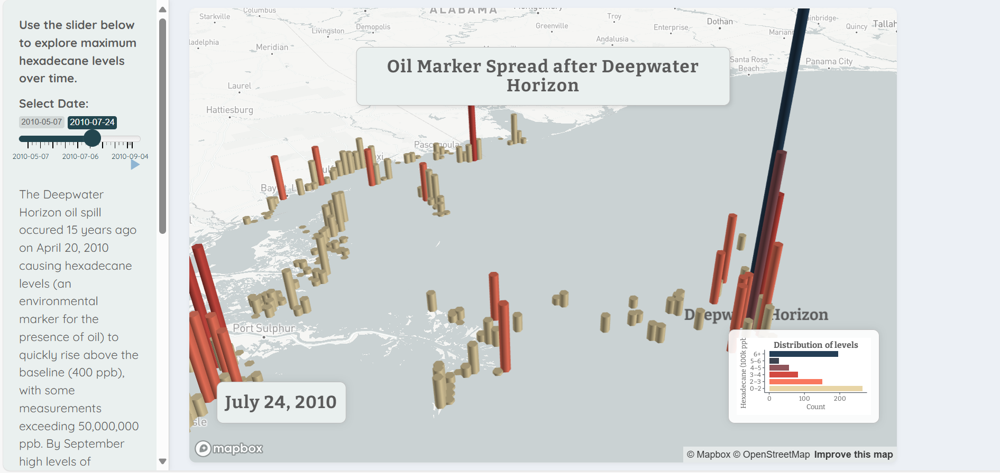{.project-thumb}

### Deepwater Horizon Hexadecane App (Environmental Scientists)

**Impact:** Provided an intuitive interactive dashboard for exploring spatial and temporal concentration patterns from the Deepwater Horizon oil spill, improving communication of key insights.

**What it does:** Hexadecane visualization dashboard for environmental analysis.

**Tech:** R · Shiny · 3D Geospatial visualization

[View app](https://edwardarchaeology.shinyapps.io/deepwater-hexadecane/){.btn .btn-primary .btn-sm}

[Environmental]{.badge} [Remote sensing]{.badge} [Visualization]{.badge}

</div>

<div class="project-card">

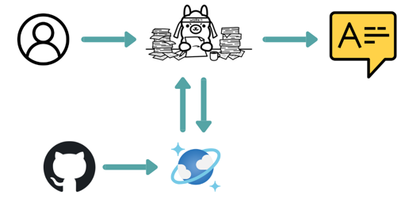{.project-thumb}

### Local RAG Ingestion Pipeline (Developers & Data Teams)

**Impact:** Reduced effort required to convert large code repositories into searchable knowledge stores by building a local-first RAG pipeline, enabling faster retrieval and exploration of code content.

**What it does:** Local RAG pipeline using CosmosDB and Ollama for code repository search.

**Tech:** Python · RAG · Cosmos DB · Ollama

[View code](https://github.com/edwardarchaeology/Repository-RAG){.btn .btn-primary .btn-sm}

[RAG]{.badge} [Ollama]{.badge} [Azure Cosmos]{.badge}

</div>

<div class="project-card">

<video class="project-thumb" autoplay muted loop playsinline>
  <source src="assets/project_videos/app_vid.mp4" type="video/mp4">
</video>

**Tech:** Python · Desktop app  

### Monte Carlo Sphere: 2D &amp; 3D π Approximation

A standalone Python executable that demonstrates Monte Carlo estimation of π in 2D and 3D with interactive visuals. Built to show how numerical methods connect to geometry in an intuitive way.

[View code](https://github.com/edwardarchaeology/monte_carlo_sphere){.btn .btn-primary .btn-sm}

[Numerical methods]{.badge} [Desktop]{.badge} [Education]{.badge}

</div>

<div class="project-card">

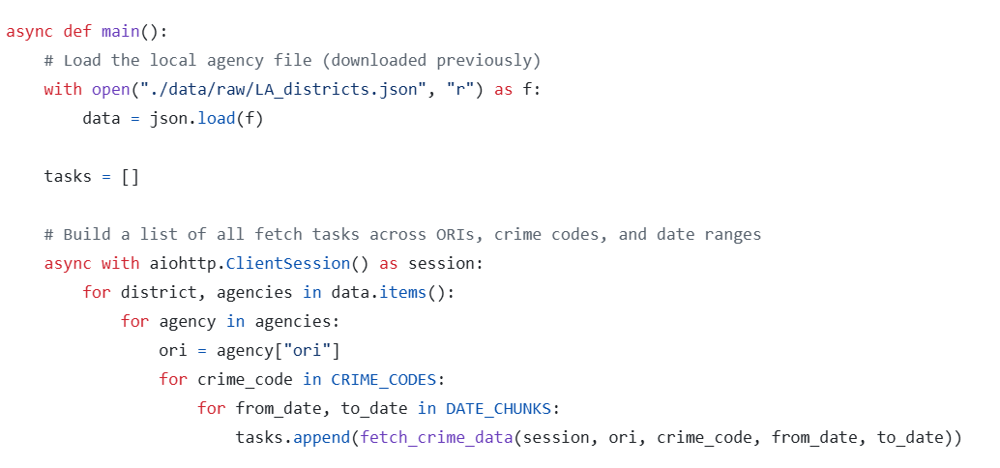{.project-thumb}

### FBI Crime Data Explorer API Bot (Data Analysts)

**Impact:** Automated large-batch requests to the FBI Crime Data Explorer API, eliminating manual splitting and restructuring of queries, enabling cleaner, faster data extraction for analysis.

**What it does:** Automated FBI API query bot for bulk data extraction.

**Tech:** Python · APIs · Automation

[View code](https://github.com/edwardarchaeology/FBI_CDE_API_bot){.btn .btn-primary .btn-sm}

[APIs]{.badge} [Automation]{.badge} [Crime data]{.badge}

</div>

<div class="project-card">

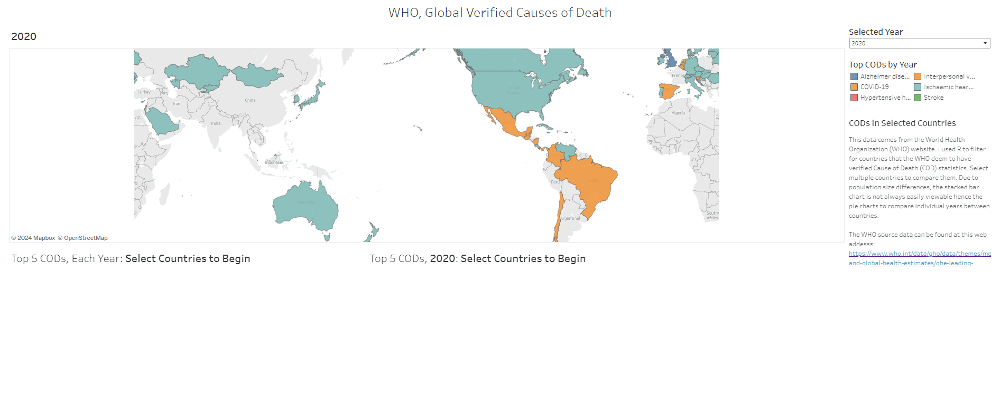{.project-thumb}

### WHO Mortality Dashboard (Public Health Analysts)

**Impact:** Transformed static WHO mortality data into an interactive dashboard with dynamic filters and calculated metrics, helping analysts uncover patterns and trends more efficiently than with static reports.

**What it does:** Dynamic mortality analytics dashboard for public health insights.

**Tech:** Tableau · Data visualization

[View project](project_writeups/who-mortality-dashboard.qmd){.btn .btn-primary .btn-sm}

[Tableau]{.badge} [Health data]{.badge}

</div>

<div class="project-card">

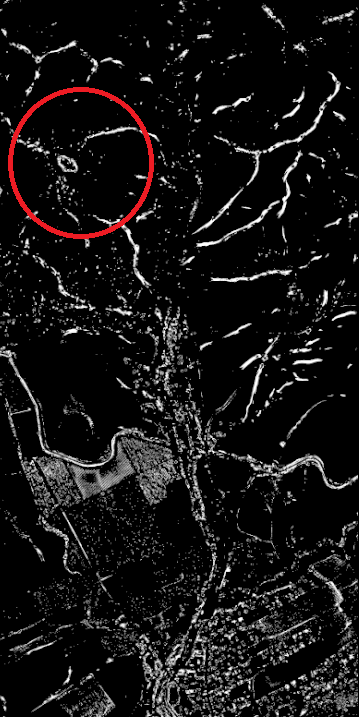{.project-thumb}

### Geomorphons Terrain Feature Processing (GIS Specialists)

**Impact:** Standardized generation and processing of geomorphon terrain features within QGIS, enabling reproducible landform classification workflows at scale.

**What it does:** Terrain feature workflow for automated geomorphon processing.

**Tech:** Python · QGIS · Geoprocessing

[View project](project_writeups/geomorphons-standalone.qmd){.btn .btn-primary .btn-sm}

[Geoprocessing]{.badge} [Terrain]{.badge}

</div>

<div class="project-card">

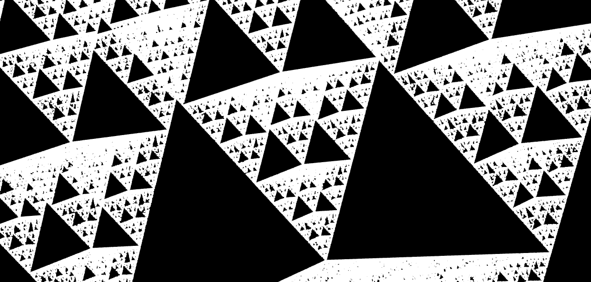{.project-thumb}

**Tech:** R · Data viz  

### Chaos Game in 3D

A 2D chaos game rendered in three dimensions, used as a teaching and exploration tool for probabilistic fractal generation and advanced data visualization.

[View project](project_writeups/chaos-game-3d.qmd){.btn .btn-primary .btn-sm}

[Fractals]{.badge} [Visualization]{.badge}

</div>

</div>

---

<h2>Research &amp; methods</h2>

<div class="portfolio-grid"
     style="display:grid;grid-template-columns:repeat(auto-fit,minmax(340px,1fr));gap:2rem;margin-top:2rem;">

<div class="project-card">

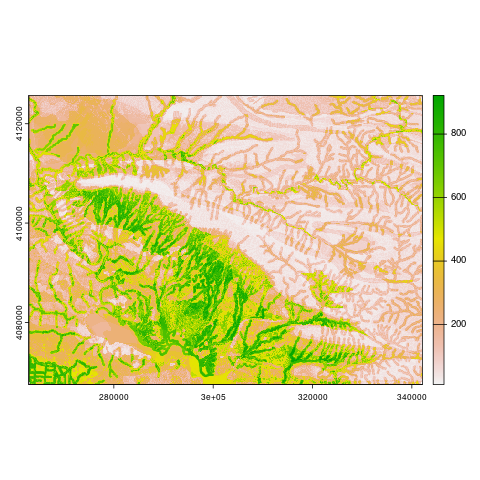{.project-thumb}

### Sampling Bias &amp; Environmental Correlation (Kurdistan)

**Impact:** Quantified and corrected for sampling bias in environmental predictors, improving reliability of archaeological predictive models for Northern Iraqi Kurdistan.

**What it does:** ML insights into archaeological sampling bias using RF, GBM, and MaxEnt.

**Tech:** Machine learning · RF · GBM · MaxEnt

[View project](project_writeups/kurdistan-sampling-bias.qmd){.btn .btn-primary .btn-sm}

[Archaeology]{.badge} [SDM]{.badge} [Bias]{.badge}

</div>

<div class="project-card">

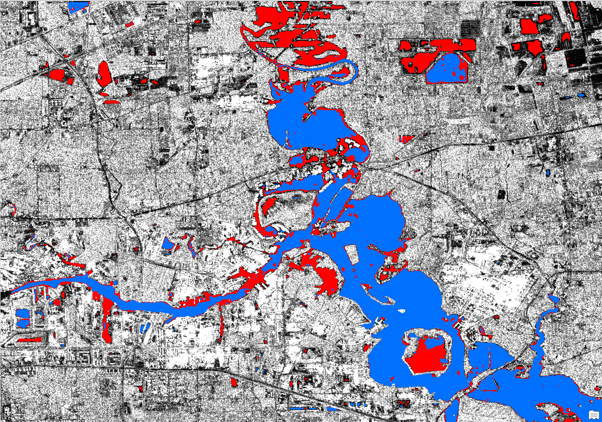{.project-thumb}

### Deep Learning for Flood Evaluation (Emergency Management)

**Impact:** Enhanced flood extent detection and risk assessment by combining spatial data with deep learning models, improving situational awareness for planners.

**What it does:** Flood risk evaluation using deep learning and remote sensing.

**Tech:** Deep learning · Remote sensing

[View project](https://arcg.is/1Gaayv){.btn .btn-primary .btn-sm}

[Remote sensing]{.badge} [Flooding]{.badge}

</div>

<div class="project-card">

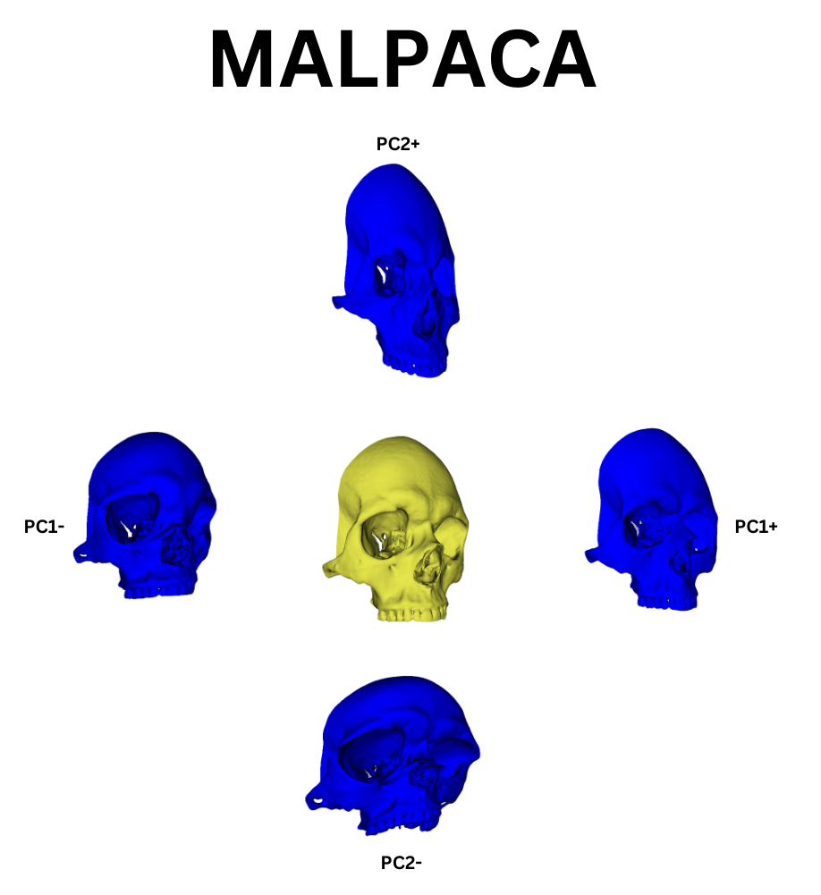{.project-thumb}

### Automated 3D Landmarking (Human Viscerocranium) (Analysts)

**Impact:** Reduced manual landmark placement workload by applying automated techniques on 3D skull scans, supporting classification and shape analysis.

**What it does:** Automated morphometric landmarking for 3D cranial analysis.

**Tech:** 3D morphometrics

[View project](project_writeups/autolandmarking-skulls.qmd){.btn .btn-primary .btn-sm}

[3D]{.badge} [Morphometrics]{.badge}

</div>

<div class="project-card">

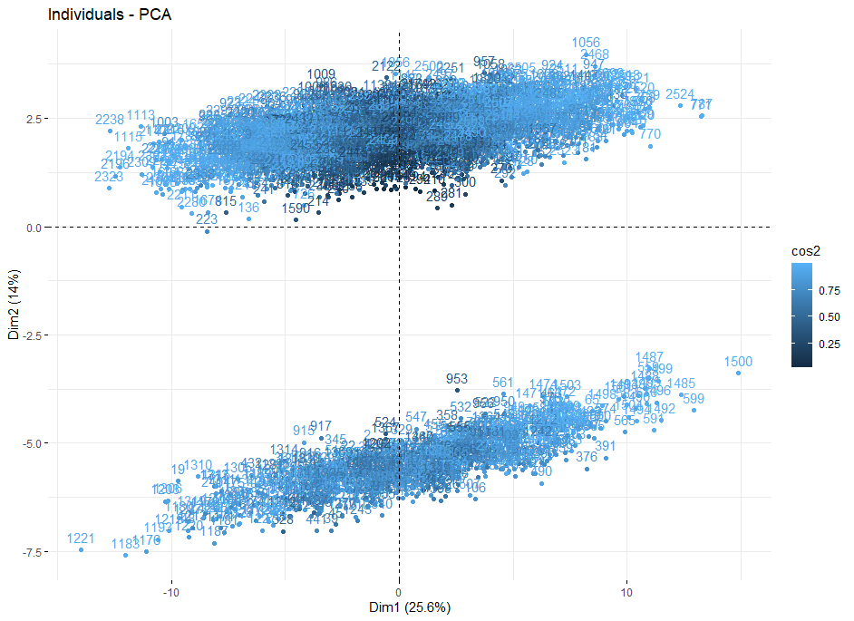{.project-thumb}

### PCA for Visual Inspection of Missing Data (Analysts)

**Impact:** Helped analysts visualize and understand missing data patterns using PCA, improving diagnosis of potential biases prior to modeling.

**What it does:** Data quality visualization tool for missing data analysis.

**Tech:** PCA · Data exploration

[View project](project_writeups/pca-missing-data.qmd){.btn .btn-primary .btn-sm}

[PCA]{.badge} [Data quality]{.badge}

</div>

<div class="project-card">

{.project-thumb}

### Machine Learning for Archaeological Geographic Data (Archaeologists)

**Impact:** Demonstrated an end-to-end pipeline for applying machine learning to geographic archaeological datasets, uncovering spatial influence of key covariates.

**What it does:** Geographic ML pipeline for archaeological research.

**Tech:** Machine learning

[View project](project_writeups/ml-archaeology-geo.qmd){.btn .btn-primary .btn-sm}

[Archaeology]{.badge} [ML]{.badge}

</div>

<div class="project-card">

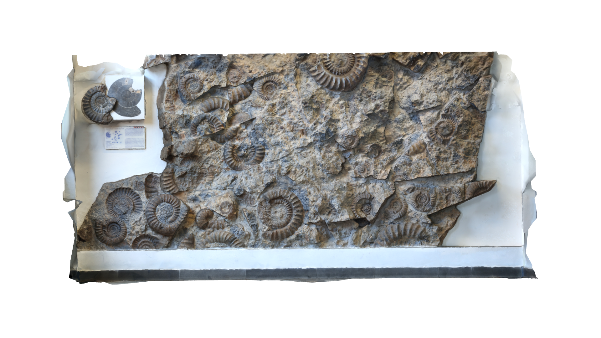{.project-thumb}

### Structure-from-Motion 3D Photogrammetry (Scientists & Analysts)

**Impact:** Delivered a complete photogrammetry workflow to generate detailed 3D models from photographs, useful for both scientific visualization and spatial analysis.

**What it does:** 3D model generation workflow using photogrammetry.

**Tech:** Photogrammetry · 3D modeling

[View project](project_writeups/photogrammetry-3d.qmd){.btn .btn-primary .btn-sm}

[Photogrammetry]{.badge} [3D models]{.badge}

</div>

</div>
